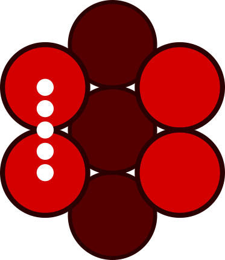

## HtBDC - Umbrella Sampling

<table>
  <tr>
    <th>x-direction</th>
    <th>y-direction</th>
  </tr>
  <tr>
    <td></td>
    <td></td>
  </tr>
</table>

### Rigid | 50eps | k: 1000 | dx: 0.1 A | 5 ns (Scan 8)

  

    
<b>x-direction</b>

      
      
      
  

### Rigid | 50eps | k: 500 | dx: 0.1 A | 5 ns (Scan 7)

  

    
<b>x-direction</b>

      
      
      
  

### Rigid | 50eps | k: 200 | dx: 0.1 A | 5 ns (Scan 6)

  

    
<b>x-direction</b>

      
      
      
  

### Rigid | 50eps | k: 100 | dx: 0.1 A | 5 ns (Scan 5)

  

    
<b>x-direction</b>

      
      
      
  

  

    
<b>x-direction</b>

      
      
      
  

### Rigid | 50eps | k: 50 | dx: 0.1 A | 5 ns (Scan 4)

  

    
<b>x-direction</b>

      
      
      
  

  

    
<b>y-direction</b>

      
      
      

### Rigid | 50eps | k: 10 | dx: 0.2 A | 5 ns (Scan 3)

  

    
<b>x-direction</b>

      
      
      
  

  

    
<b>y-direction</b>

      
      
      

