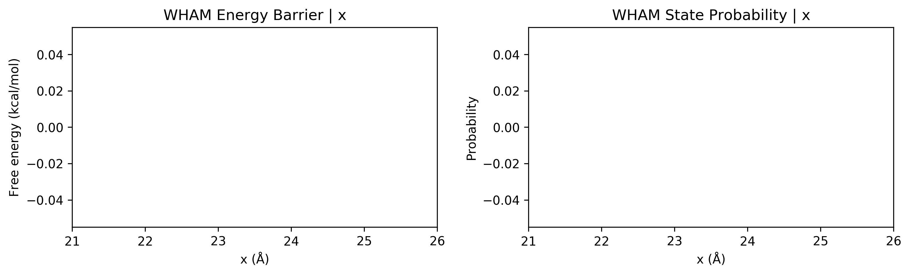
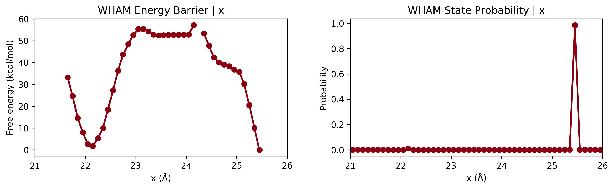
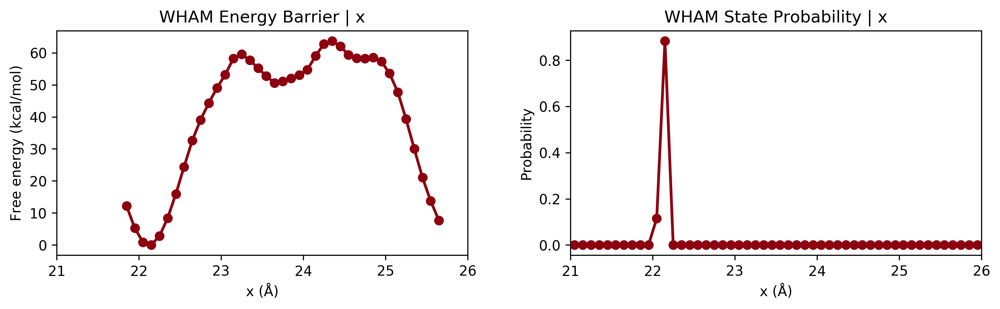
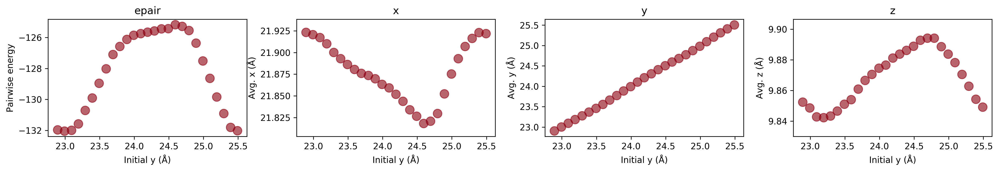
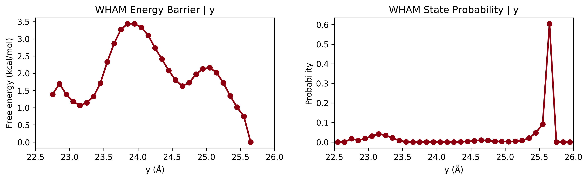
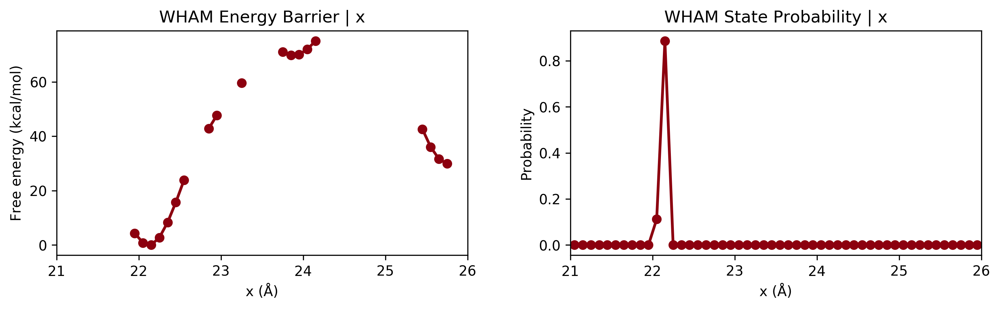
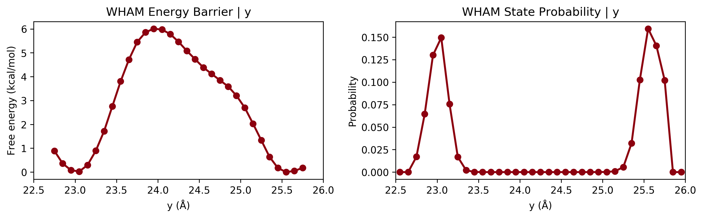

## Dynamically Corrected Transition State Theory (dcTST)

In order to estimate diffusion transition state theory could be used with umbrella sampling.
For the unit cell of a Cu(110) surface we can divide the surface into grid points and
constrain our molecule to the grid point using a spring.
Then using Weighted Histogram Analysis Method (WHAM) we can calculate the free energy barrier
for diffusion in each direction.

Above, on the left the grid points on the Cu(110) surface is shown.
For each point an MD simulation is performed.
Then 2D WHAM analysis is used to calculate free energy barriers for moving between these points.

## 3D Surface Energy

### [1D WHAM Energy Profiles](htbdc_cu110_free_energy_1d)

### [2D WHAM Energy Profile](htbdc_cu110_free_energy_2d)

### Calculating Overall Activation Energy
The overall activation energy for diffusion in a given direction can be calculated by averaging
different energy profiles (parallel) in that direction. Assuming Boltzmann distribution, we can calculate
probabilities for each energy profile. The probability of taking each pathway is related to it's
activation energy exponentially. Therefore we first take the activation energy for each pathway and
calculate probability for that pathway as follows:

After calculating probabilities for each pathway in the desired direction we can then multiply the
activation energies with the probabilities to get the average activation energy as follows:

### Rigid | 50eps | k: 1000 | dx: 0.1 A | 5 ns (Scan 8)

  

    
<b>x-direction</b>

      
      
      
  

### Rigid | 50eps | k: 500 | dx: 0.1 A | 5 ns (Scan 7)

  

    
<b>x-direction</b>

      
      
      
  

### Rigid | 50eps | k: 200 | dx: 0.1 A | 5 ns (Scan 6)

  

    
<b>x-direction</b>

      
      
      
  

  

    
<b>y-direction</b>

      
      
      
  

  

    
<b>y-direction 2.5 nearest neighbors</b>

      
      
      
  

  

    
<b>y-direction | eps: 100</b>

      
      
      
  

### Rigid | 50eps | k: 100 | dx: 0.1 A | 5 ns (Scan 5)

  

    
<b>x-direction</b>

      
      
      
  

  

    
<b>y-direction</b>

      
      
      
  

### Rigid | 50eps | k: 50 | dx: 0.1 A | 5 ns (Scan 4)

  

    
<b>x-direction</b>

      
      
      
  

  

    
<b>y-direction</b>

      
      
      

### Rigid | 50eps | k: 10 | dx: 0.2 A | 5 ns (Scan 3)

  

    
<b>x-direction</b>

      
      
      
  

  

    
<b>y-direction</b>

      
      
      

