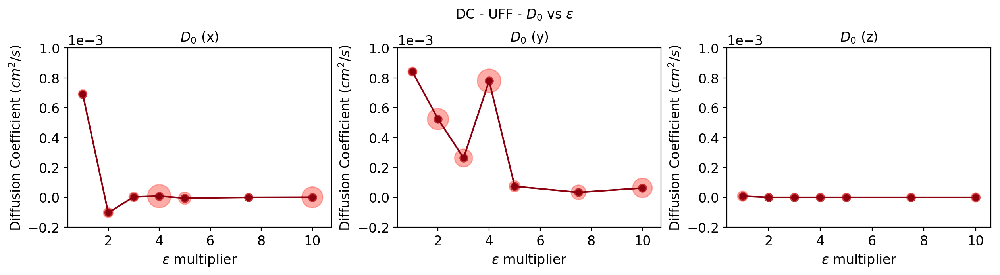
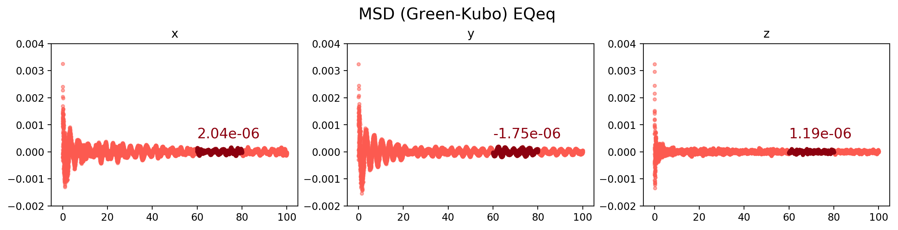
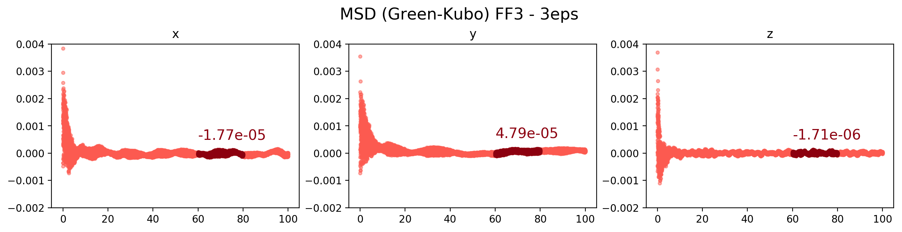
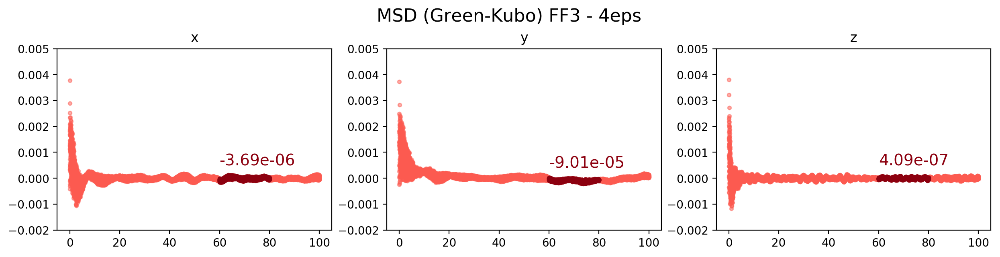
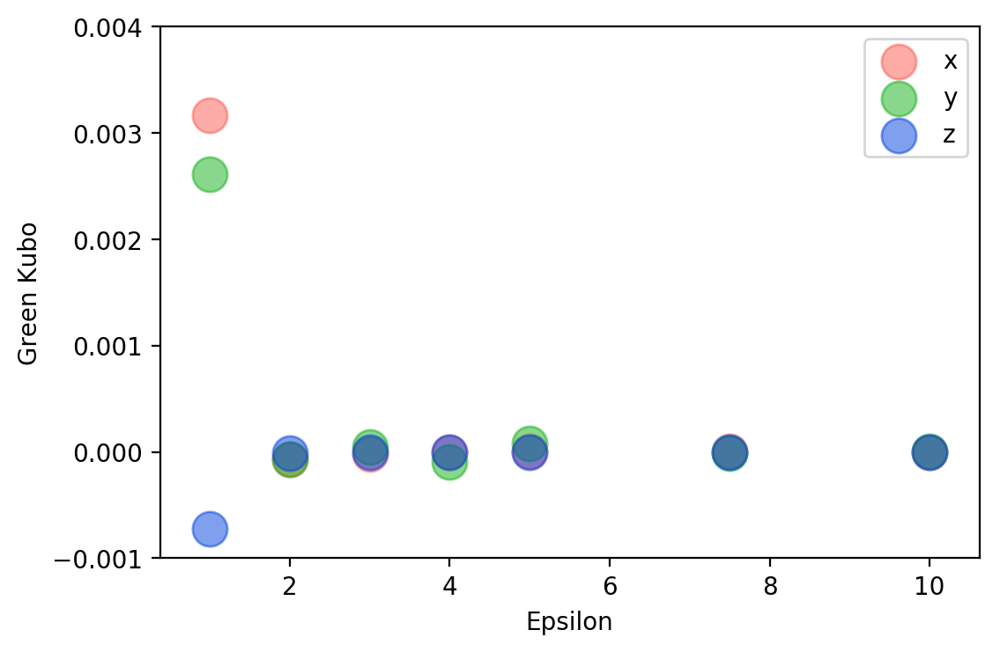
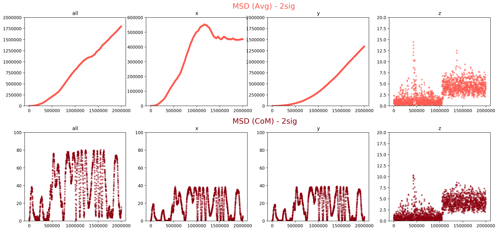
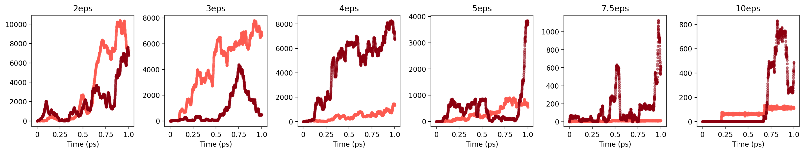
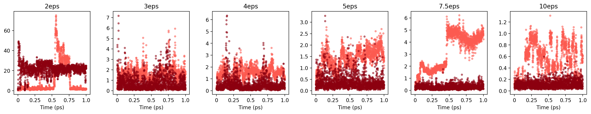

---
box_periodicity:
  headers: ['ppp', 'ppf']
  links:
  - assets/img/DC_Cu110/DC_Cu110_ppp.gif
  - assets/img/DC_Cu110/DC_Cu110_ppf.gif
temperature:
  headers: ['150 K', '175 K', '200 K', '225 K', '250 K']
  links:
  - assets/img/DC_Cu110/DC_Cu110_ppp_T150.gif
  - assets/img/DC_Cu110/DC_Cu110_ppp_T175.gif
  - assets/img/DC_Cu110/DC_Cu110_ppp_T200.gif
  - assets/img/DC_Cu110/DC_Cu110_ppp_T225.gif
  - assets/img/DC_Cu110/DC_Cu110_ppp_T250.gif
box_size:
  headers: ['2 nm', '3 nm', '4 nm', '5 nm']
  links:
  - assets/img/DC_Cu110/DC_Cu110_ppp_z20.gif
  - assets/img/DC_Cu110/DC_Cu110_ppp_z30.gif
  - assets/img/DC_Cu110/DC_Cu110_ppp_z40.gif
  - assets/img/DC_Cu110/DC_Cu110_ppp_z50.gif
---
Force field parameters
----------------------

<table>
  <tr>
    <th>Force Field</th>
    <th colspan="2" style="text-align:center">Cu</th>
    <th colspan="2" style="text-align:center">C</th>
    <th colspan="2" style="text-align:center">H</th>
  </tr>
  <tr>
    <th>LJ</th>
    <th>ε (kcal/mol)</th>
    <th>σ (Å)</th>
    <th>ε (kcal/mol)</th>
    <th>σ (Å)</th>
    <th>ε (kcal/mol)</th>
    <th>σ (Å)</th>
  </tr>
  <tr>
    <th>UFF</th>
    <td>0.005000</td>
    <td>3.113691</td>
    <td>0.105000</td>
    <td>3.430851</td>
    <td>0.044000</td>
    <td>2.571134</td>
  </tr>
  <tr>
    <th>DRE</th>
    <td>0.055000</td>
    <td>4.044680</td>
    <td>0.095100</td>
    <td>3.472990</td>
    <td>0.015200</td>
    <td>2.846421</td>
  </tr>
</table>

Decacylene - UFF
----------------

<b>Diffusion Coefficient</b>

Decacylene - DRE
----------------

<b>Diffusion Coefficient</b>

HtBDC - UFF
-----------

<b>Diffusion Coefficient</b>

HtBDC - DRE
-----------

<b>Diffusion Coefficient</b>

### Tests
-   Periodic vs non-periodic *z-direction*
-   Temperature
-   Box size
-   Decacylene - slab distance

## Box Periodicity

<table><tr><th>{{ head }}</th></tr>
<tr><th></th></tr></table>

### Temperature

<table>
  <tr><th>{{ head }}</th></tr>
  <tr>
    
      <th></th>
    
  </tr>
</table>

### Box size

#### *z-direction*

<table>
  <tr><th>{{ head }}</th></tr>
  <tr>
    
      <th></th>
    
  </tr>
</table>

#### *xy-plane*

<table>
  <tr><th>{{ head }}</th></tr>
  <tr>
    
      <th></th>
    
  </tr>
</table>

### DC - UFF - Green-Kubo
Here Green-Kubo approximation is used.

**Without charges - FF1**

**With EQeq charges - FF2**

**Increased Epsilon - FF3**

### DC - UFF (FF3) - Effect of Sigma

<table>
  <tr><th>{{ head }}</th></tr>
  <tr>
    
      <th></th>
    
  </tr>
</table>

### DC vs HtBDC - UFF (FF3) - MSD Comparison by direction

<b>x</b>

<b>y</b>

<b>z</b>

<b>all</b>

### DC - UFF - LAMMPS MSD CoM vs No CoM

The dark red data is generated using `com yes` option to use center of mass for decacylene. The light red data is without using the center of mass but averaging each atom in decacylene.

**Without charges - FF1**

**With EQeq charges - FF2**

**Increased Epsilon - FF3**

