---
ff_comparison:
  headers: ['FF1', 'FF2 (EQeq)', 'FF3 (5ε)']
  links:
    - assets/img/msd/traj-ff1.gif
    - assets/img/msd/traj-eqeq.gif
    - assets/img/msd/ff3-5eps.gif
ff3:
  headers: ['2ε', '3ε', '4ε', '5ε', '7.5ε', '10ε']
  links:
    - assets/img/msd/ff3-2eps.gif
    - assets/img/msd/ff3-3eps.gif
    - assets/img/msd/ff3-4eps.gif
    - assets/img/msd/ff3-5eps.gif
    - assets/img/msd/ff3-7.5eps.gif
    - assets/img/msd/ff3-10eps.gif
---

MD simulations (LAMMPS) of Decacylene and Hexa-*tert*-butyl-Decacylene
======================================================================

  

    
<strong>Show molecules</strong>

    <table>
      <tr>
        <th>DC</th>
        <th>HtBDC</th>
      </tr>
      <tr>
        <th>
          

          

        </th>
        <th>
          

          

        </th>
      </tr>
    </table>
  

Structure generation
====================

The molecules are placed on a Cu(110) slab. The metal slab is generated using a replication of `10 x 15 x 5` parallel to *xy-plane*.
The molecules are then aligned to *xy-plane* and placed `5 Å` above the slab in the *z-direction*.
Fixing *z-length* of the box at `50 Å`, the simulation boxes have a size of `39.08 Å x 41.45 Å x 50.0 Å`.

  

    

      <strong>Click here for interactive structures</strong>
    

    <table>
      <tr>
        <th>DC</th>
        <th>HtBDC</th>
      </tr>
      <tr>
        <th>
          

          

        </th>
        <th>
          

          

        </th>
      </tr>
    </table>
  

Simulation setup
================

The motion of the molecules on Cu(110) surface is investigated by Molecular Dynamcis simulations using LAMMPS.
Initially effect of force field is investigated.

<h2>Universal Force Field</h2>

Different configurations are tested using the universal force field:
-   <b>FF1:</b> UFF with no-charges
-   <b>FF2:</b> UFF with EQeq partial charges
-   <b>FF3:</b> UFF with no-charges but increased pairwise interactions

<h3>Force field comparison</h3>

  <table>
    <tr><th>{{ head }}</th></tr>
    <tr>
      
        <th></th>
      
    </tr>
  </table>

  

<b>More information</b>

  <h3>EQeq</h3>
  
Charge assignment is done using the EQeq code with the above configuration (DC .5 nm above Cu110 slab).

  <b>Cu110 Charge Distribution</b>
  

  <b>DC Charge Distribution</b>
  
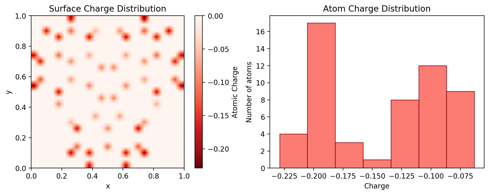

  
As seen above the surface and DC are assigned positive and negative overall charges. Moreover, the charge distribution of the surface is localized to molecule's initial configuration. These cause the molecule to strongly <i>stick</i> on the surface and not diffuse.

  
The partial charges can be calculated separately for the surface and the molecule to avoid localized charge distribution. Moreover, a polarizable force field could be used to approximate local charge
  deviations of the surface atoms.

  <h3>FF3</h3>
  
In <b>FF3</b> the pairwise interaction parameters between <i>Decacylene</i> and <i>Cu110</i> surface are varied. Here is how a change in <i>ε</i> parameter of the <i>Lennard-Jones</i> potential effects pairwise energy during simulation.

  
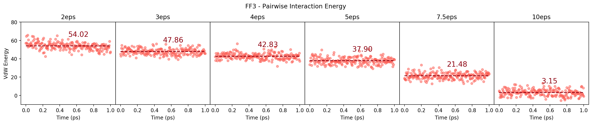

  
With increasing <i>ε</i> for <i>Cu-C</i> and <i>Cu-H</i> interactions the total Van der Waals energy is decreased resulting in increased attractive forces between <i>Decacylene</i> and <i>Cu110</i>.

  
Here are the MD trajectories with increasing epsilon:

  <table>
    <tr><th>{{ head }}</th></tr>
    <tr>
      
        <th></th>
      
    </tr>
  </table>
  

<h2>UFF4MOF</h2>

Mean Squared Displacement (MSD)
===============================

Mean Squared Displacement Calculation
-------------------------------------

  

    
<b>Click here for calculation details</b>

    
MSD is calculated using the <code>compute msd</code> command in Lammps and also using the <a href="https://github.com/kbsezginel/angstrom" target="_blank">Ångström</a> Python package. In Lammps, MSD calculations were done both with and without the center of mass option. You can see the differences in the <a href="/decacylene-si" target="_blank">Supplementary Information</a>. Here, MSD results without using the center of mass option are shown.

    <h3>Lammps MSD vs Calculated MSD</h3>
    <h4>Single Atom vs Grouped Atoms (HtBDC - UFF (FF3) - 5ε)</h4>
    
In Lammps you can group atoms and then use the <code>compute msd</code> command to calculate MSD of this group of atoms.
    As a result, Lammps returns a 4 element array of MSD values for x, y, z directions and overall.
    Then, you can also tell at which interval you want to print these MSD values.
    Here, I am showing results for MSD values printed each 1000 timesteps where <code>dt = 0.5 fs</code>.
    The simulations are 2 million timesteps long corresponding to 1 ps.
    Using <a href="https://github.com/kbsezginel/angstrom" target="_blank">Ångström</a> I first convert trajctory coordinates to
    non-periodic coordinates and then calculate MSD for a single atom using the MD trajectory.
    Here is the comparison between Lammps MSD and calculated (Ångström) MSD results.

    
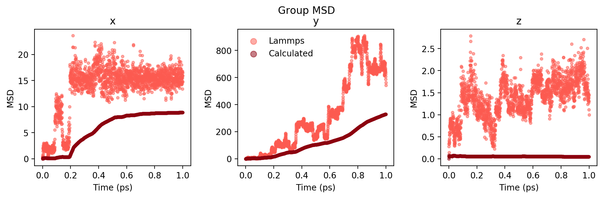

    
Alternatively, you can also calculate the MSD for a single atom in Lammps.
    Theoretically, as the molecule is relatively small and all atoms are bonded together their MSD should not be too different.
    Here are the resultsd comparing single atom MSD in Lammps and calculated single atom MSD.

    
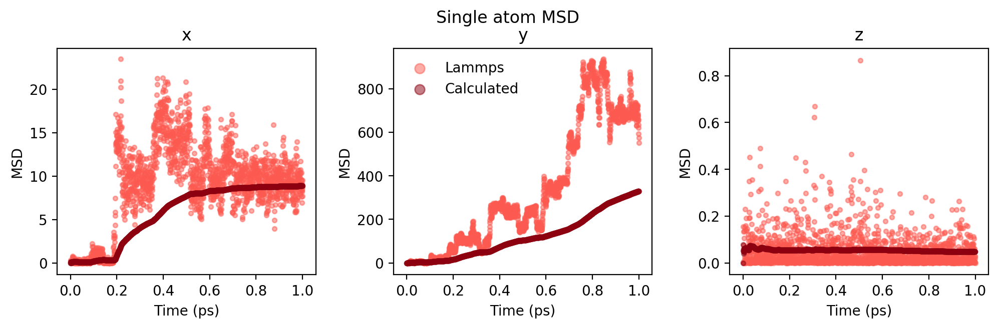

    
As seen in figures, the single atom MSD results are more comparable to calculated MSD results, however
    there are still differences. Overall, the curves follow the same trends but the calculated MSD curve
    is much more smooth compared to Lammps results. I am still investigating where this difference is coming from.

    <h4>DC - UFF (FF3) MSD Comparison</h4>
    
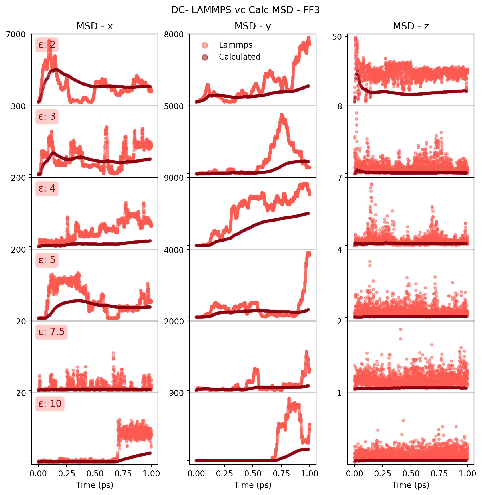

    <h4>HtBDC - UFF (FF3) MSD Comparison</h4>
    
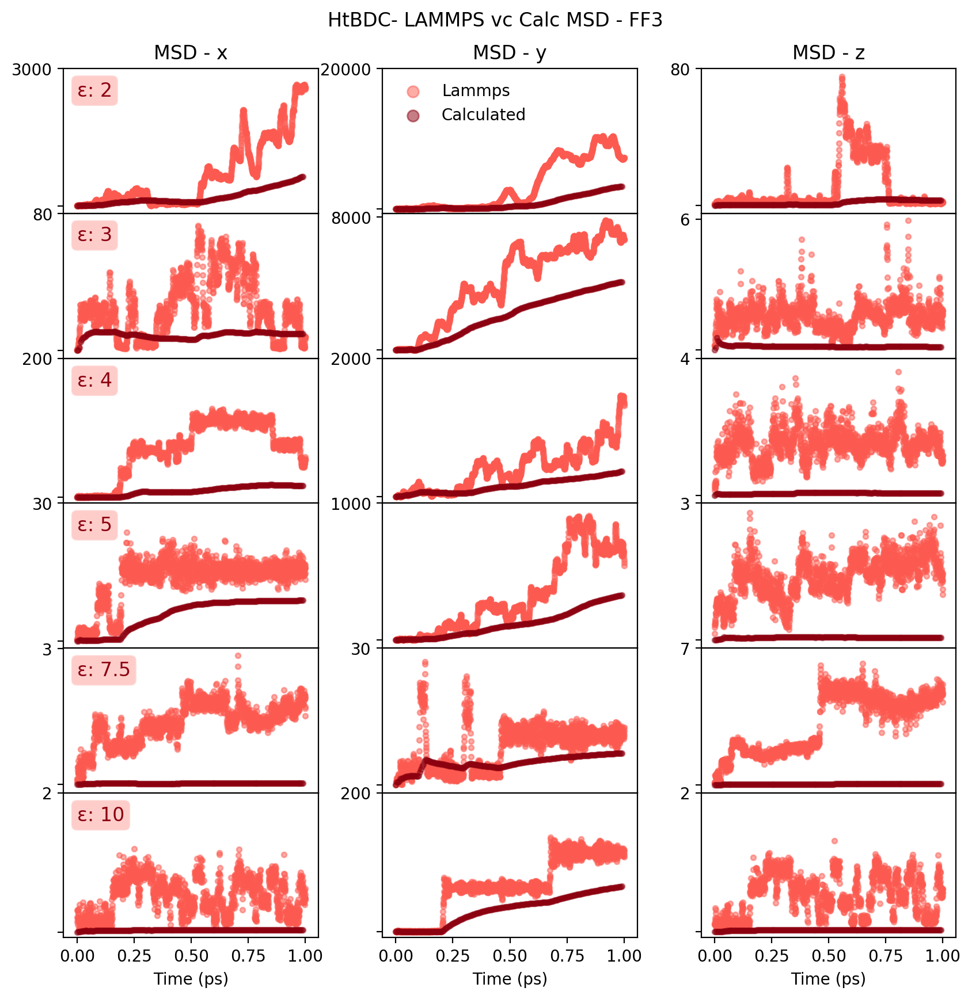

  

Experimental Comparison
=======================

  

    
<b>Click here for details</b>

    
<b>Decacylene - UFF (FF3) - Increased Epsilon</b>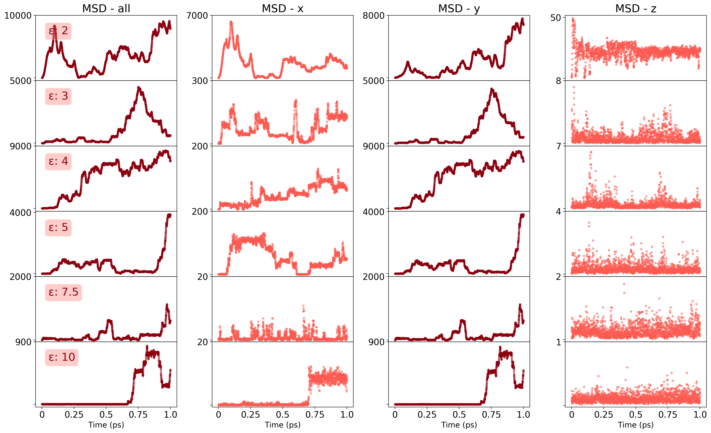

  

Diffusivity
===========

  

    
<b>Click here for calculation details</b>

    <h3>Linear fitting to MSD vs Time (LAMMPS)</h3>

    
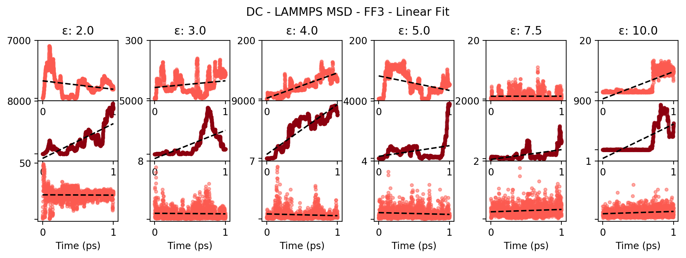

    
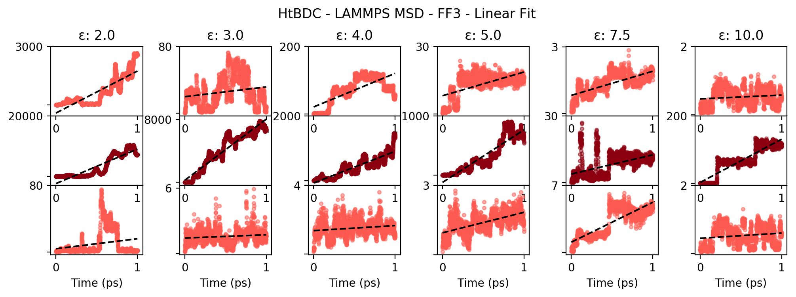

    <h3>Linear fitting to MSD vs Time (Angstrom)</h3>

    
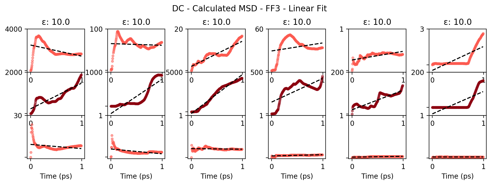

    
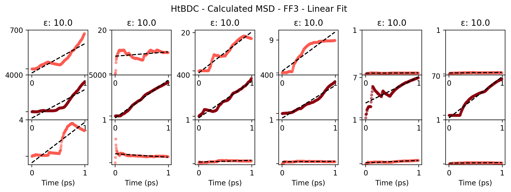

    <h3>Plotting the slopes (y-axis)</h3>

    <table>
      <tr>
        <th>LAMMPS</th>
        <th>Calculated</th>
      </tr>
      <tr>
        <th>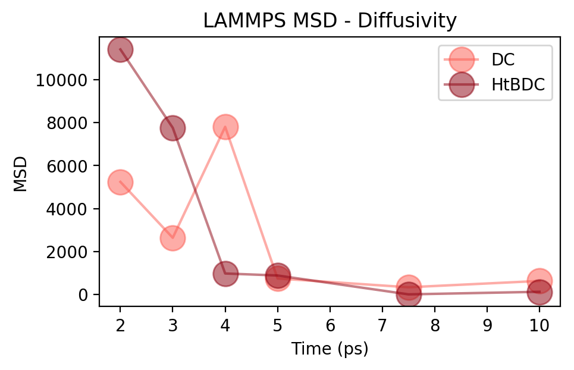</th>
        <th>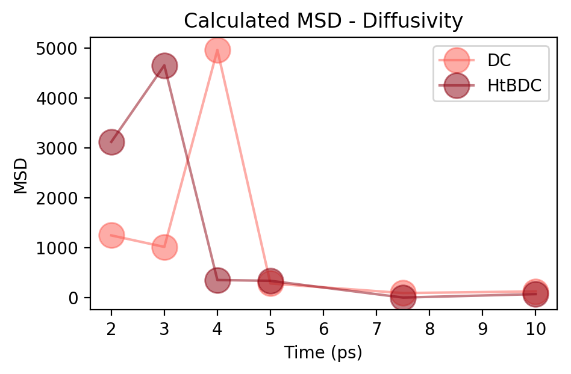</th>
      </tr>
    </table>

  

