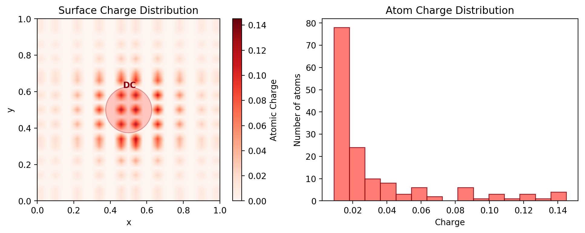
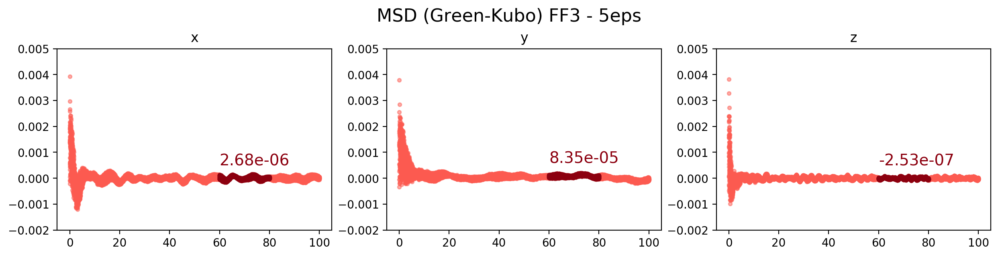

---
ff_comparison:
  headers: ['FF1', 'FF2 (EQeq)', 'FF3 (5ε)']
  links:
    - assets/img/msd/traj-ff1.gif
    - assets/img/msd/traj-eqeq.gif
    - assets/img/msd/ff3-5eps.gif
ff3_eps:
  headers: ['1σ', '2σ', '4ε', '10ε']
  links:
    - assets/img/msd/traj-ff1.gif
    - assets/img/msd/ff3-2eps.gif
    - assets/img/msd/ff3-4eps.gif
    - assets/img/msd/ff3-10eps.gif
ff3:
  headers: ['2ε', '3ε', '4ε', '5ε', '7.5ε', '10ε']
  links:
    - assets/img/msd/ff3-2eps.gif
    - assets/img/msd/ff3-3eps.gif
    - assets/img/msd/ff3-4eps.gif
    - assets/img/msd/ff3-5eps.gif
    - assets/img/msd/ff3-7.5eps.gif
    - assets/img/msd/ff3-10eps.gif
ff3_sig:
  headers: ['2σ', '2ε2σ']
  links:
    - assets/img/msd/ff3-2sig.gif
    - assets/img/msd/ff3-2eps2sig.gif
---
MD simulations (LAMMPS) for diffusion of Decacylene
===================================================

Decacylene (DC) on Cu (110)
----------------------

The metal slab is generated using a replication of `10 x 15 x 5` parallel to *xy-plane*.
The decacylene is then aligned to *xy-plane* and placed `5 Å` above the slab in *z-direction*.
Fixing *z-length* of the box at `50 Å`, the simulation box has a size of `39.08 Å x 41.45 Å x 50.0 Å`.

Force field
-----------
Different force fields are tested for the above setup.
-   **FF1:** UFF with no-charges
-   **FF2:** UFF with EQeq
-   **FF3:** UFF with no-charges but increased pairwise interactions

###  Force field comparison

<table>
  <tr><th>{{ head }}</th></tr>
  <tr>
    
      <th></th>
    
  </tr>
</table>

### EQeq
Charge assignment is done using the EQeq code with the above configuration (DC .5 nm above Cu110 slab).

**Cu110 Charge Distribution**

**DC Charge Distribution**

### FF3
In **FF3** the pairwise interaction parameters between *Decacylene* and *Cu110* surface are varied. Here is how a change in *ε* parameter of the *Lennard-Jones*
potential effects pairwise energy during simulation.

With increasing *ε* for *Cu-C* and *Cu-H* interactions the total Van der Waals energy is decreased resulting in increased attractive forces between *Decacylene* and *Cu110*.

Mean Squared Displacement (MSD)
-------------------------------

### Lammps MSD
MSD is calculated using `compute msd` command in Lammps.
The dark red data is generated using `com yes` option to use center of mass for decacylene. The light red data is without using the center of mass but averaging each atom in decacylene.

**Without charges - FF1**

**With EQeq charges - FF2**

**Increased Epsilon - FF3**

### Green-Kubo
Here Green-Kubo approximation is used.

**Without charges - FF1**

**With EQeq charges - FF2**

**Increased Epsilon - FF3**

### FF3 - Effect of Epsilon

<table>
  <tr><th>{{ head }}</th></tr>
  <tr>
    
      <th></th>
    
  </tr>
</table>

**Decacylene:**

### FF3 - Effect of Sigma

<table>
  <tr><th>{{ head }}</th></tr>
  <tr>
    
      <th></th>
    
  </tr>
</table>

### All Epsilon

<table>
  <tr><th>{{ head }}</th></tr>
  <tr>
    
      <th></th>
    
  </tr>
</table>

### Molecule comparison

#### x

#### y

#### z

#### all

