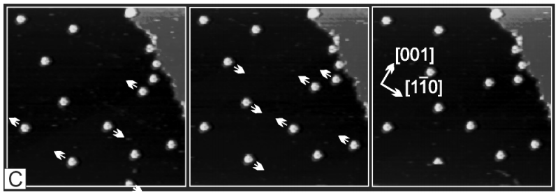
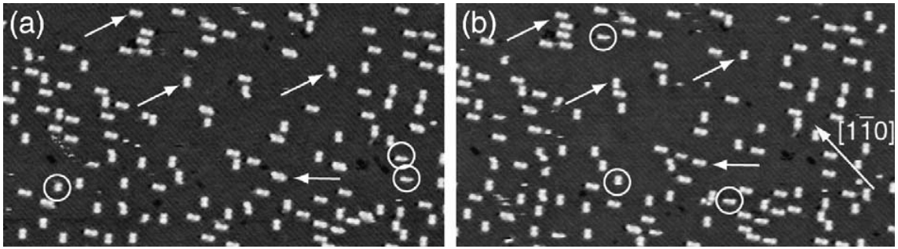

## Properties of large organic molecules on metal surfaces[1](https://www.sciencedirect.com/science/article/pii/S0079681603000042?via%3Dihub)

Check 42, 44, 79, 80

### DC & HtBDC on Cu(110)[2](https://doi.org/10.1103/PhysRevLett.88.156102)
STM images (Δt = 13.9 s, T: 194 K) of HtBDC. Arrows indicate the direction in which molecules will
have moved in the successive image.

- Activation energy -> TPEE: 0.175 eV - DNHD: 0.195 eV

### PVBA on Pd(110)[3](https://doi.org/10.1063/1.478430)
Consecutive STM images (Δt = 220 s, T: 361 K) show that only a fraction of molecules moved.
Each molecule is approximately 11 Å in length and 1.25 Å in width.

- Activation energy: 0.83 ± 0.03 eV
- Attempt frequency: 1010.3±0.4 s-1
- Temperature range: 335 - 370 K

### C60 on Pd(110)[4](https://aip.scitation.org/doi/pdf/10.1063/1.478430)

- Activation energy: 1.4 ± 0.2 eV
- Attempt frequency: 1014.4±0.4 s-1
- Temperature range: 435 - 485 K

### DNHD, TPEE, and BtPHD on Cu(110)[5](https://doi.org/10.1063/1.4811353)

- Activation energy -> TPEE: 0.175 eV - DNHD: 0.195 eV - BtPHD: 0.325 eV

### Nanocar1 on Au(111)[6](https://pubs.acs.org/doi/full/10.1021/nl051915k)

#### References
1. [Rosei, F., Schunack, M., Naitoh, Y., Jiang, P., Gourdon, A., Laegsgaard, E., ... & Besenbacher, F. (2003). **Properties of large organic molecules on metal surfaces.** *Progress in Surface Science*, 71(5-8), 95-146.](https://www.sciencedirect.com/science/article/pii/S0079681603000042)
2. [Schunack, M., et al. **Long jumps in the surface diffusion of large molecules.** *Physical review letters* 88.15 (2002): 156102.](https://doi.org/10.1103/PhysRevLett.88.156102)
3. [Weckesser, Jens, Johannes V. Barth, and Klaus Kern. **Direct observation of surface diffusion of large organic molecules at metal surfaces: PVBA on Pd (110).** *The Journal of chemical physics* 110.11 (1999): 5351-5354.](https://doi.org/10.1063/1.478430)
4. [Weckesser, J., J. V. Barth, and K. Kern. **Mobility and bonding transition of C 60 on Pd (110).** *Physical Review B* 64.16 (2001): 161403.](https://doi.org/10.1103/PhysRevB.64.161403)
5. [Sun, Qiang, et al. "Controlling on-surface molecular diffusion behaviors by functionalizing the organic molecules with tert-butyl groups." Applied Physics Letters 103.1 (2013): 013103.](https://doi.org/10.1063/1.4811353)
6. [Shirai, Yasuhiro, et al. "Directional control in thermally driven single-molecule nanocars." Nano Letters 5.11 (2005): 2330-2334.](https://pubs.acs.org/doi/full/10.1021/nl051915k)

### More

[Molecular Machines Working on Surfaces and at Interfaces](https://onlinelibrary.wiley.com/doi/full/10.1002/cphc.200700528)

[Design principles for Brownian molecular machines: how to swim in molasses and walk in a hurricane](http://pubs.rsc.org/en/content/articlehtml/2007/cp/b708995c)

[Simulating molecular shuttle movements: Towards computer-aided design of nanoscale transport systems](http://pubs.rsc.org/-/content/articlehtml/2006/lc/b601754a)

[Transport of adsorbates at metal surfaces: from thermal migration to hot precursors](https://www.sciencedirect.com/science/article/pii/S0167572900000029#aep-section-id64)
