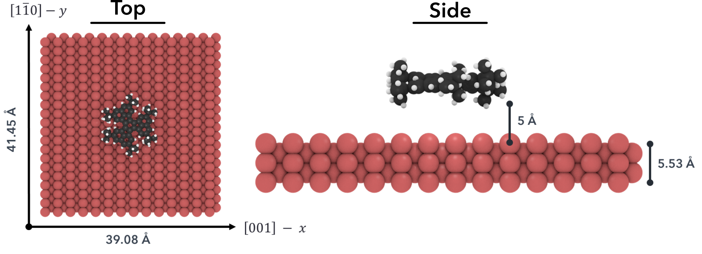
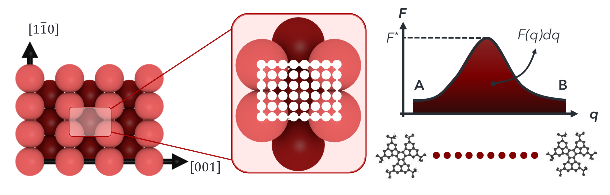

# Introduction

Controlling molecular motion on surfaces is one of the first steps towards bottom-up construction of nanoscale machines. This process is commonly utilized in cells to transport molecular cargo: enzyme molecules are moved along protein filament tracks converting chemical energy into mechanical work. Careful design of the molecular structure and selection of the appropriate surface can enable precise manipulation of the molecular diffusion. Several strategies have been shown to greatly influence diffusion such as molecular functionalization and adjusting the orientation of the molecule with respect to the substrate lattice. Although these strategies are useful, to achieve a nanoscale understanding and control over the dynamics of molecular motion on surfaces it is crucial to develop theoretical models and utilize modern computational tools. Developing a robust computational method is crucial to get further insights and deeper understanding of the molecular surface diffusion which then can be used to design molecules to tailor diffusion properties such as speed and directionality.

In this work, we investigated the diffusion of 9 large organic molecules on a Cu (110) surface. The molecules were selected from available experimental diffusion data in the literature. We then investigated different modeling strategies to qualitatively and quantitatively reproduce experimental diffusion results using molecular dynamics (MD) simulations. First using MD simulation trajectories we calculated diffusion coefficient from mean squared displacement. Even though the diffusion coefficients calculated using this method was very high compared to experimental findings we were able to reproduce directionaliy of motion on the surface (y-direction preferred over x-direction).Then, we performed umbrella sampling with Weighted Histogram Analysis Method to calculate free energy landscape of diffusion on the surface. Using the free energy landspace we then calculated hopping rate and diffusion coefficient using the dynamically corrected transition state theory method.

# Simulation setup (free energy method)
Each molecule was placed parallel on a ~ 4x4 nm periodic Cu(110) surface ~5 A above as seen below.

<p align="center"></p>

Then the smallest repeating unit of the surface was divided into grid points in both directions (see figure below). For each of these points a constrained MD simulation was performed, attaching the molecule to that point by applying a spring force.

<p align="center"></p>

Then using the fluctuations of the position of the molecule a free
energy barrier was calculated with Weighted Histogram Analysis Method using [Alan Grossfield's implementation](http://membrane.urmc.rochester.edu/content/wham).
In this implementation the free energy barrier can be calculated using either one or two dependent variables. Using both x and y position fluctuations free energy barriers were calculated ([the barriers can be seen here](/dctst#free-energy-barriers)).

## Problem statement
The [dynamically corrected transition state theory method](https://pubs.acs.org/doi/abs/10.1021/jp0542470) requires a free energy barrier in order to calculate the diffusion coefficient. However, for a given direction I am not sure what is the correct way to get an average energy barrier.

Currently, in order to estimate diffusion in one of the directions I am averaging (Boltzmann) all the parallel paths for that direction. So for y-direction I look at all
linear paths with different x positions and I average the activation energy and area under the curve for all these barriers. Then using the average activation energy and area under the curve I calculate the diffusion coefficient using equations below.

<p align="center"></p>


### Questions
- In order to calculate diffusion coefficient in the two main directions which grid points should be considered?
- How does the periodicity of the grid come into play?
- There are alternative methods to calculate free energy barriers such as [Multistate Bennett Acceptance Ratio](http://www.alchemistry.org/wiki/Multistate_Bennett_Acceptance_Ratio). How do these compare to WHAM and do they have any advantage?
- Are there alternative methods that would be more suitable to calculate slow diffusion events (D: 1e-15 cm2/s) such as these large molecules on surfaces?

### Simulation details
```
software: LAMMPS

ensemble: NVT
temperature: 200 K
timestep: 1 fs
length: 1e6 timesteps (10 ns)
spring constant (k): 50 kcal/mol
force field: UFF (rigid molecule + rigid surface)
Cu epsilon increased by 50 times to increase
molecule surface adsorption energy and match experimental results
```
