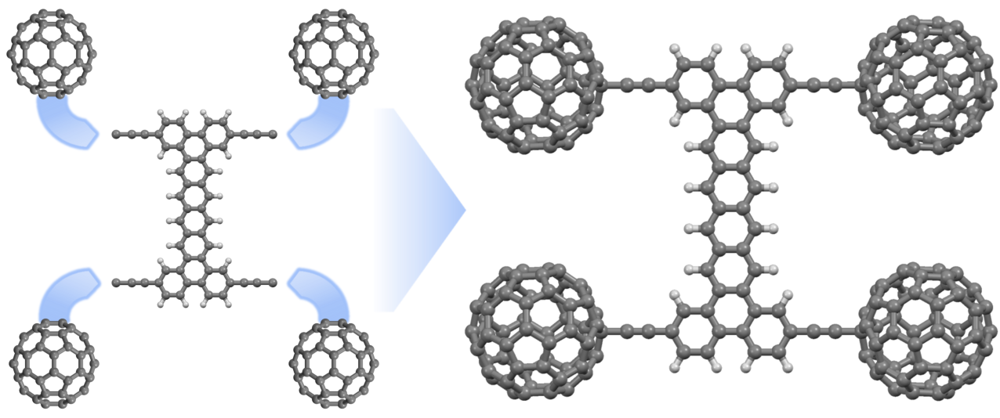
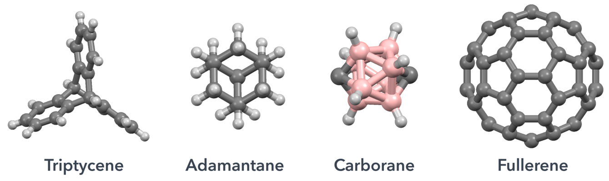

Nanocar
=======
Python scripts and more for designing molecular cars.

Nanocars can be assembled by selecting a chassis and set of wheels.

  

### Wheels

  

Several molecular wheels are available in nanocar library.
-   [C60][C60]
-   [Carborane][Carborane]
-   [Adamantane][Adamantane]
-   [Triptycene][Triptycene]

### Chassis
Experimental and hypothetical molecular chassis are available in nanocar library.

---
[Carborane]: https://en.wikipedia.org/wiki/Carborane
[C60]: https://en.wikipedia.org/wiki/Buckminsterfullerene
[Adamantane]: https://en.wikipedia.org/wiki/Adamantane
[Triptycene]: https://en.wikipedia.org/wiki/Triptycene
