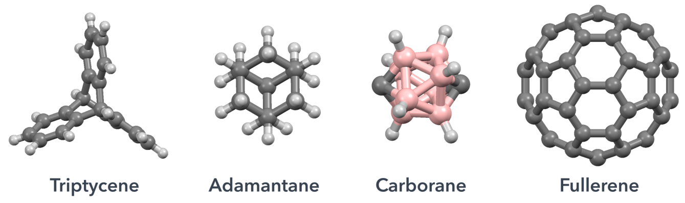

# Nanocar
Python library for designing molecular cars.

## Navigation
- [Lammps setup for simulations][lammps-setup]
- [Pyrene on rigid wall][rigid-wall]
- [Diffusion on surfaces][molecular-diffusion-on-a-surface]

## Installation

## Usage

### Wheels

  

Several molecular wheels are available in nanocar library.
- [C60]
- [Carborane]
- [Adamantane]
- [Triptycene]

### Chassis
Experimental and hypothetical molecular chassis are available in nanocar library.

Nanocars can be assembled by selecting a chassis and set of wheels.

  

-------------------------------------------------------------------------------------------
[Carborane]: https://en.wikipedia.org/wiki/Carborane
[C60]: https://en.wikipedia.org/wiki/Buckminsterfullerene
[Adamantane]: https://en.wikipedia.org/wiki/Adamantane
[Triptycene]: https://en.wikipedia.org/wiki/Triptycene
[rigid-wall]: https://kbsezginel.github.io/Nanocar/rigid-wall
[lammps-setup]: https://kbsezginel.github.io/Nanocar/lammps-setup
[molecular-diffusion-on-a-surface]: https://kbsezginel.github.io/Nanocar/molecular-diffusion-on-a-surface
