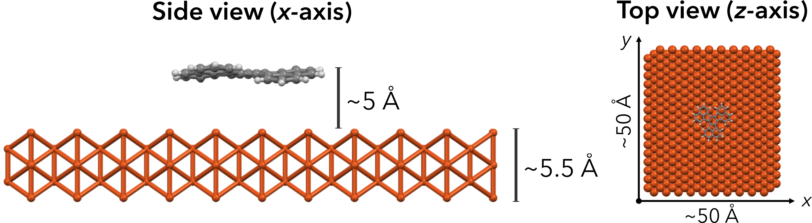

LAMMPS Simulation Setup
=======================

Initially the molecules are aligned to the *xy*-plane and placed 5A above the surface.

Sinced the surface reconstruction is minimal, the surface atoms can be kept rigid during the simulation. There are different ways to restrain atom positions in LAMMPS. For this study we want to keep the atom positions same and we want the surface to interact with the molecule by non-bonded interactions.

The easiest way to do this in LAMMPS is to perform the time integration only for the molecule. To make sure the non-bonded interactions between the surface and the molecule is still calculated I made several tests.

Pairwise Interactions
---------------------

Molecular Energy
----------------

### Final Procedure
For this study the optimal procedure is as follows:
- Read **surface** + **mol** data file (coordinates)
- Don't perform minimization
- Assign uniform dist velocity to **mol** atoms
- Turn of Cu - Cu pairwise interactions
- Modify Cu - **mol** pairwise interactions
- Delete all bonded potentials for the surface (`delete_bonds    surf multi remove`)
- Apply fix only to the molecule (NVT ensemble)
- Run for desired number of steps

### Important Findings
- `pair_coeff      1 1 1.0 0.0` and `pair_coeff      1 1 0.0 0.0` do not give the same answers. If you want to turn off pairwise interactions between two types of atoms make sure you only make the epsilon zero not the sigma.

### Questions
- Should we include pairwise interactions between Cu atoms?
- How much do we care about the lattice parameter of the surface atoms? The initial structure and force field parameters would result in different surfaces which in turn would affect the diffusion. Moreover, the temperature dependency of the lattice parameter is not considered here as well.
