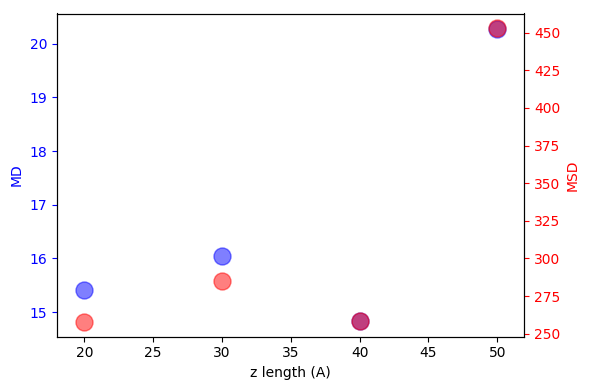

---
box_periodicity:
  headers: ['ppp', 'ppf']
  links:
  - assets/img/DC_Cu110/DC_Cu110_ppp.gif
  - assets/img/DC_Cu110/DC_Cu110_ppf.gif
temperature:
  headers: ['150 K', '175 K', '200 K', '225 K', '250 K']
  links:
  - assets/img/DC_Cu110/DC_Cu110_ppp_T150.gif
  - assets/img/DC_Cu110/DC_Cu110_ppp_T175.gif
  - assets/img/DC_Cu110/DC_Cu110_ppp_T200.gif
  - assets/img/DC_Cu110/DC_Cu110_ppp_T225.gif
  - assets/img/DC_Cu110/DC_Cu110_ppp_T250.gif
box_size:
  headers: ['2 nm', '3 nm', '4 nm', '5 nm']
  links:
  - assets/img/DC_Cu110/DC_Cu110_ppp_z20.gif
  - assets/img/DC_Cu110/DC_Cu110_ppp_z30.gif
  - assets/img/DC_Cu110/DC_Cu110_ppp_z40.gif
  - assets/img/DC_Cu110/DC_Cu110_ppp_z50.gif
---
# MD simulation setup (LAMMPS) for diffusion

# Decacylene on Cu (110)

The metal slab is generated using a replication of `10 x 15 x 5` parallel to *xy-plane*.
The decacylene is then aligned to *xy-plane* and placed `5 Å` above the slab in *z-direction*.
Fixing *z-length* of the box at `50 Å`, the simulation box has a size of `39.08 Å x 41.45 Å x 50.0 Å`.

### Tests
-   Periodic vs non-periodic *z-direction*
-   Temperature
-   Box size
-   Decacylene - slab distance

## Box Periodicity

<table><tr><th>{{ head }}</th></tr>
<tr><th></th></tr></table>

### Temperature

<table>
  <tr><th>{{ head }}</th></tr>
  <tr>
    
      <th></th>
    
  </tr>
</table>

### Box size

<table>
  <tr><th>{{ head }}</th></tr>
  <tr>
    
      <th></th>
    
  </tr>
</table>

# Decacylene on Pd (110)

### Box size

#### 2 nm

  

#### 3 nm

  

#### 4 nm

  

#### 5 nm

  

#### Displacement

  

