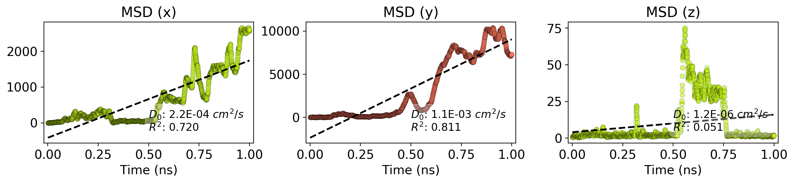
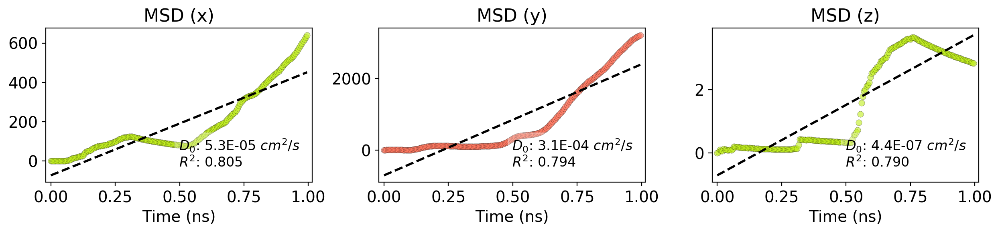

scripts
=======

MSD Trajectory
--------------

LAMMPS MSD vs time
------------------

Angstrom MSD vs time
------------------

### Simulation details

-   Simulation directory: /home/kutay/Documents/git/Nanocar/scripts
-   Report date: 2018-02-27 15:54

#### Simulation files

<table>
  <tr>
    <th>File</th>
    <th>Date</th>
    <th>Size</th>
  </tr>
  <tr>
    <td>msd-time-lammps.png</td>
    <td>2018-02-27 15:54</td>
    <td>313.9 kB</td>
  </tr>
  <tr>
    <td>traj.xyz</td>
    <td>2018-02-27 15:51</td>
    <td>964.2 kB</td>
  </tr>
  <tr>
    <td>__pycache__</td>
    <td>2018-02-27 15:51</td>
    <td>4.0 kB</td>
  </tr>
  <tr>
    <td>.ipynb_checkpoints</td>
    <td>2018-02-26 17:07</td>
    <td>4.0 kB</td>
  </tr>
  <tr>
    <td>movie.gif</td>
    <td>2018-02-27 15:54</td>
    <td>6068.0 kB</td>
  </tr>
  <tr>
    <td>sim_report.py</td>
    <td>2018-02-27 15:44</td>
    <td>1.5 kB</td>
  </tr>
  <tr>
    <td>msd-time-ang.png</td>
    <td>2018-02-27 15:54</td>
    <td>177.0 kB</td>
  </tr>
  <tr>
    <td>msdtools.py</td>
    <td>2018-02-27 15:49</td>
    <td>8.3 kB</td>
  </tr>
  <tr>
    <td>vis-state</td>
    <td>2018-02-27 15:02</td>
    <td>4.0 kB</td>
  </tr>
  <tr>
    <td>plot-test.ipynb</td>
    <td>2018-02-27 11:12</td>
    <td>82.4 kB</td>
  </tr>
  <tr>
    <td>msd1.csv</td>
    <td>2018-02-27 15:51</td>
    <td>185.7 kB</td>
  </tr>
  <tr>
    <td>vis-state.vmd</td>
    <td>2018-02-27 13:24</td>
    <td>4.5 kB</td>
  </tr>
</table>

